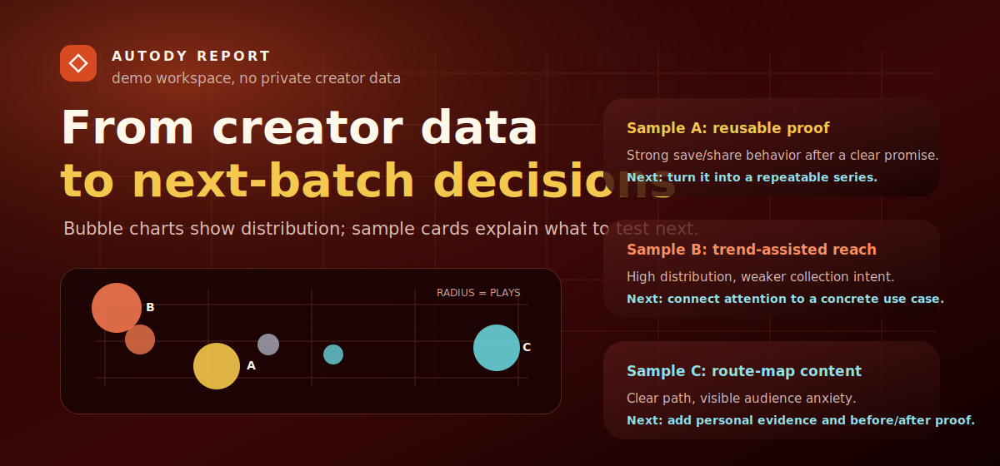

# Autody: 抖音分析

Autody 是一个给 Codex 用的抖音创作者分析 skill。它让 agent 用你的本机登录态分析你自己的抖音作品，补齐逐字稿、深度指标、Top 评论，并生成 JSON、CSV、Markdown 和 HTML 报告。



## 只分析自己的账号

Autody 只面向你本人拥有或被授权管理的抖音账号与视频数据。请勿用本项目分析、抓取或规避访问任何他人的非授权数据。若使用者将本项目用于分析他人视频、账号或未授权内容，由使用者自行承担全部法律、合规与平台责任。

## 30 秒上手

推荐环境：Mac + Codex Desktop + Chrome。Chrome 负责你的登录态，Codex 负责按 skill 执行流程。

```bash
npx autody@latest install
```

如果你已经全局安装：

```bash
npm install -g autody
autody install --force
```

也可以从 GitHub 手动安装：

```bash
git clone https://github.com/kizzhang/autody.git
mkdir -p ~/.codex/skills
cp -R autody/skills/douyin-analysis ~/.codex/skills/
```


## 给 Codex 的一句话

```text
Use $douyin-analysis to analyze my own Douyin creator account, backfill missing metrics, extract transcripts one by one, and export JSON/CSV/Markdown/HTML reports.
```

Autody 会要求 agent：

- 先审计缺口，再只补缺失或过期字段。
- 每条作品完成后立刻写入 progress，断了可以继续。
- 发给豆包提取 transcript 时一条视频开一个页面，用完就关，避免页面越来越卡。
- 低播放但被隐藏/限流的样本只做文案诊断，不参与曝光归因。
- HTML 报告必须有可读结构：气泡图、因子地图、关键样本复盘、逐条表格和下一批建议。


## 会抓哪些数据

基础数据：

- 作品编号、发布时间、标题文案、类型、公开视频链接。
- 播放、点赞、评论、转发、收藏。
- transcript 或图文文字，含来源和状态。

深度数据：

- 平均播放时长、完播率、5 秒留存。
- 涨粉、脱粉、主页访问、封面点击率。
- Top 评论、评论点赞数、回复数。

## 会输出什么

默认输出到 `outputs/douyin_analysis_YYYY-MM-DD/`：

```text
douyin_works_final.json
transcript_progress.json
deep_metrics_progress.json
content_gap_audit.json
douyin_deep_works_final.json
douyin_deep_works_final.csv
douyin_deep_transcripts_final.md
report.html
```


## Agent 入口

- Agent 主入口：[skills/douyin-analysis/SKILL.md](skills/douyin-analysis/SKILL.md)
- 报告设计规则：[skills/douyin-analysis/references/report-design.md](skills/douyin-analysis/references/report-design.md)
- 数据流程参考：[skills/douyin-analysis/references/douyin-workflow.md](skills/douyin-analysis/references/douyin-workflow.md)
- 人类快速提示：[AGENTS.md](AGENTS.md)

CLI 只负责安装和检查 skill：

```bash
autody install --force
autody doctor
autody skill-path
```

## 安全与合规

本项目不会要求导出或读取浏览器 cookie 文件、密码、localStorage 或会话数据库。Playwright 登录态只应保存在你本机项目目录的 `.auth/`，并且 `.auth/`、`.cheat-cache/`、cookies、raw private dumps 永远不要提交到 GitHub。

## License

MIT License. See [LICENSE](LICENSE).
