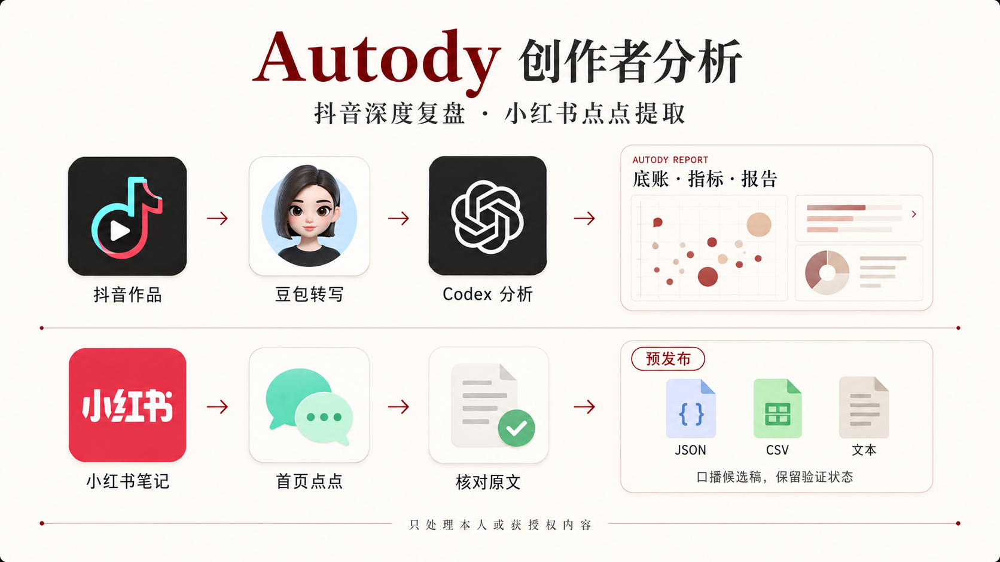
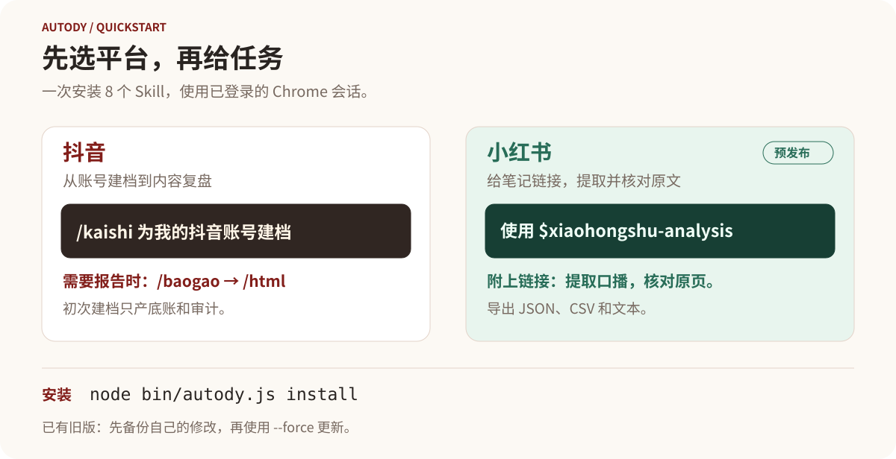
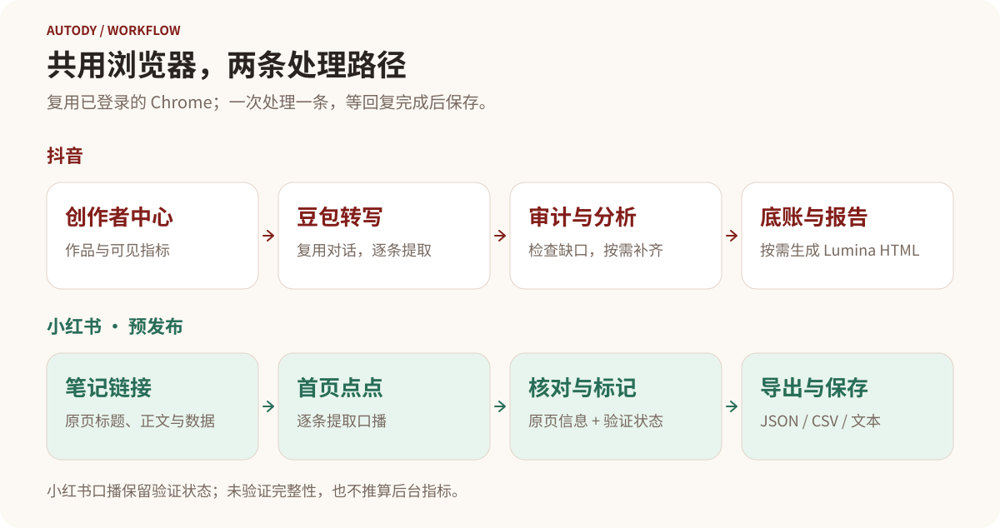
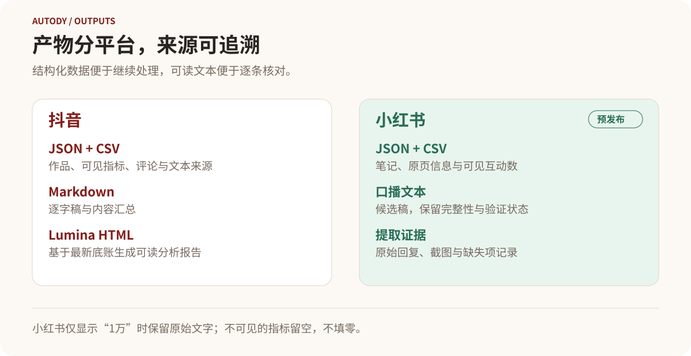

<p align="center">
  
</p>

# Autody: 抖音分析 + 小红书点点提取

Autody 是一组给 Codex 使用的创作者分析 skills，通过 Codex Chrome Extension 操作你已经登录的 Chrome 会话。

| 平台 | 入口 | 当前支持 |
| --- | --- | --- |
| 抖音 | `/kaishi`、`/gengxin`、`/buchong`、`/tijian`、`/baogao`、`/html` | 创作者后台底账、逐字稿、深度指标、评论和 Lumina HTML 报告 |
| 小红书（预发布） | `$xiaohongshu-analysis` | 将笔记链接交给首页点点，提取视频口播候选稿，核对原页正文与可见互动数，导出 JSON、CSV 和文本 |

小红书有独立的 Skill 和数据口径。现有六个短命令与指标、评分、报告脚本仍用于抖音。



## 只分析自己的账号

Autody 只面向你本人拥有或被授权管理的抖音、小红书账号与内容数据。请勿用本项目分析、抓取或规避访问任何他人的非授权数据。若使用者将本项目用于分析他人视频、账号或未授权内容，由使用者自行承担全部法律、合规与平台责任。

## 30 秒上手

安装工具需要 Node.js 18 或以上；浏览器流程需要 Codex Desktop、Chrome 与 Codex Chrome Extension。抖音推荐 Mac 环境；小红书点点流程已在 Windows Chrome 登录会话中完成单条视频实测。

从 GitHub 安装：

```bash
git clone https://github.com/kizzhang/autody.git
cd autody
node bin/autody.js install
```

安装器会复制全部 8 个 Skill。已有旧版时，先备份自己修改过的 Skill，再在仓库目录运行 `git pull --ff-only` 和 `node bin/autody.js install --force`；`--force` 会替换已有同名 Skill 目录。

也可以手动复制 skill：

```bash
mkdir -p ~/.codex/skills
cp -R skills/{douyin-analysis,kaishi,gengxin,buchong,tijian,baogao,html,xiaohongshu-analysis} ~/.codex/skills/
```

需要小红书扩展时，优先使用包含 `skills/xiaohongshu-analysis` 的 GitHub 版本。npm 的 `latest` 不一定包含预发布扩展；仅在确认所需版本已发布后使用：

```bash
npx autody@latest install --force
```



## 小红书：链接交给首页点点

安装后，把你本人或获授权管理的笔记链接交给 Codex：

```text
使用 $xiaohongshu-analysis 处理这些小红书笔记链接：<链接>
通过首页点点提取口播，核对原页标题、作者、正文与可见互动数，导出 JSON、CSV 和文本；未逐句核对的口播保留未验证标记。
```

Agent 会打开原笔记和首页侧栏的「点点 ai」，一次发送一条链接，等回复完成后保存；发现缺句时针对缺段追问。标题、作者、正文、互动数以原页面为准，点点返回的口播单独保存。

默认输出到工作目录下的 `outputs/xiaohongshu_analysis_YYYY-MM-DD/`（工作区另有归档规则时遵循工作区规则）：

```text
xiaohongshu_works.json
xiaohongshu_works.csv
transcripts/
evidence/
```

每条记录保留 `platform`、`noteId`、来源、提取时间、口播状态和 `dataGaps`。例如点赞仅显示 `1万` 时保存原始文字，精确值留空；原页不展示的播放、曝光、完播率等指标也留空。

验证范围：2026-10-07 已实测一条 6 分 30 秒视频及两轮点点回复，完成口播候选稿和 JSON/CSV/TXT 保存。首轮有缺句，第二轮补充后仍未逐句校验，因此状态保留 `ai_extracted_unverified`。批量采集、图文 OCR、小红书创作者后台和口播逐字准确性尚未验证。

详见 [小红书 Skill](skills/xiaohongshu-analysis/SKILL.md) 与 [点点提示词及数据口径](skills/xiaohongshu-analysis/references/diandian-workflow.md)。

## 两条处理路径



## 抖音：Codex 命令入口

```text
/kaishi
/gengxin
/buchong
/tijian
/baogao
/html
```

Autody 会要求 agent：

- 优先用 Codex Chrome Extension 接管你已经登录的 `creator.douyin.com` Chrome tab。
- `/kaishi` 做第一次全量建档，只产底账和审计，不顺手生成报告。
- `/gengxin` 找新作品并刷新过期指标。
- `/buchong` 按 `content_gap_audit*.json` 只补缺口。
- `/tijian` 只做本地数据体检，不打开浏览器。
- `/baogao` 每次基于最新数据重新分析，输出新报告结论。
- `/html` 只用 Lumina 视觉系统，把最新数据/报告渲染成 HTML；旧 HTML 只当视觉参考，不复用旧结论。
- 先审计缺口，再只补缺失或过期字段。
- 每条作品完成后立刻写入 progress，断了可以继续。
- 发给豆包提取 transcript 时按人类节奏逐条处理：复用一个正常豆包窗口，不并发、不秒发，等结果完成并保存后再下一条；上下文污染或失败时才新开会话。
- Chrome 页面拿不到的字段标记为 `dataGap`，不再启动第二套浏览器采集器。
- 低播放但被隐藏/限流的样本只做文案诊断，不参与曝光归因。
- HTML 报告必须有可读结构：气泡图、因子地图、关键样本复盘、逐条表格和下一批建议。

## 抖音会抓哪些数据

基础数据：

- 作品编号、发布时间、标题文案、类型、公开视频链接。
- 播放、点赞、评论、转发、收藏。
- transcript 或图文文字，含来源和状态。

深度数据：

- 平均播放时长、完播率、5 秒留存。
- 涨粉、脱粉、主页访问、封面点击率。
- Top 评论、评论点赞数、回复数。

## 抖音会输出什么

默认输出到 `outputs/douyin_analysis_YYYY-MM-DD/`：

```text
douyin_works_final.json
transcript_progress.json
deep_metrics_progress.json
content_gap_audit.json
douyin_deep_works_final.json
douyin_deep_works_final.csv
douyin_deep_transcripts_final.md
report.html
report_lumina_payload.json
report_lumina.html
```

## 输出对照



## Agent 入口

- 小红书点点提取：[skills/xiaohongshu-analysis/SKILL.md](skills/xiaohongshu-analysis/SKILL.md)
- `/kaishi` 开始建档：[skills/kaishi/SKILL.md](skills/kaishi/SKILL.md)
- `/gengxin` 更新：[skills/gengxin/SKILL.md](skills/gengxin/SKILL.md)
- `/buchong` 补充：[skills/buchong/SKILL.md](skills/buchong/SKILL.md)
- `/tijian` 体检：[skills/tijian/SKILL.md](skills/tijian/SKILL.md)
- `/baogao` 报告：[skills/baogao/SKILL.md](skills/baogao/SKILL.md)
- `/html` Lumina HTML：[skills/html/SKILL.md](skills/html/SKILL.md)
- 抖音共享底层 skill：[skills/douyin-analysis/SKILL.md](skills/douyin-analysis/SKILL.md)
- Chrome Extension 工作流：[skills/douyin-analysis/references/chrome-extension-workflow.md](skills/douyin-analysis/references/chrome-extension-workflow.md)
- 报告设计规则：[skills/douyin-analysis/references/report-design.md](skills/douyin-analysis/references/report-design.md)
- Lumina HTML 工作流：[skills/douyin-analysis/references/lumina-html-workflow.md](skills/douyin-analysis/references/lumina-html-workflow.md)
- 数据流程参考：[skills/douyin-analysis/references/douyin-workflow.md](skills/douyin-analysis/references/douyin-workflow.md)
- 人类快速提示：[AGENTS.md](AGENTS.md)

CLI 只负责安装和检查 skill：

```bash
autody install --force
autody doctor
autody skill-path [skill]
```

## 安全与合规

本项目不会要求导出或读取浏览器 cookie 文件、密码、localStorage 或会话数据库。`.cheat-cache/`、cookies、raw private dumps 永远不要提交到 GitHub。

Chrome Extension-first 路径只操作正常 Chrome 标签页和页面可见数据；如果 Chrome 页面没有暴露某个字段，就在输出中明确记录缺口。

## License

MIT License. See [LICENSE](LICENSE).
